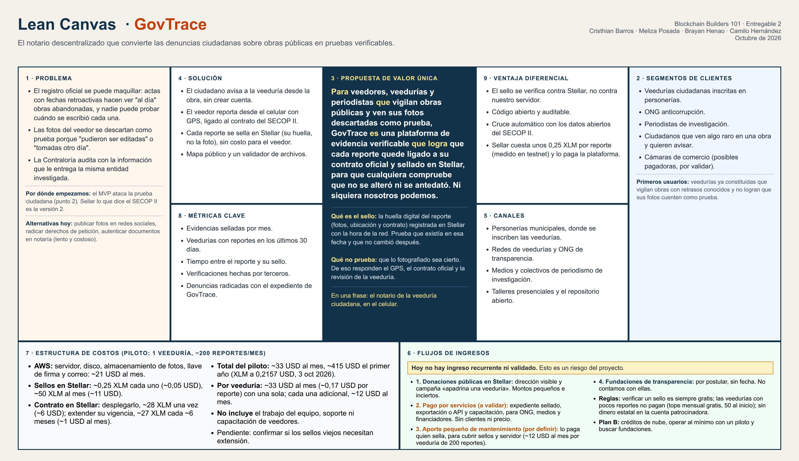
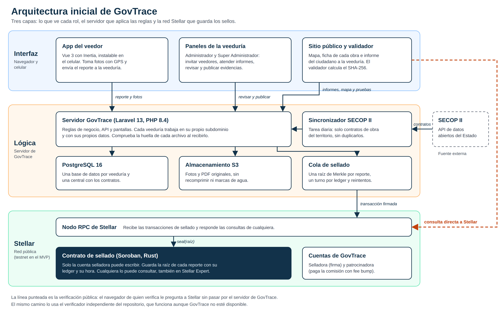

# Product Blueprint

**Nombre del proyecto:** GovTrace

**Repositorio (enlace obligatorio):** [github.com/cristhianbarros/GovTrace](https://github.com/cristhianbarros/GovTrace)

---

## Contenido

1. [Priorización de historias](#1-priorización-de-historias)
2. [Propuesta de valor](#2-propuesta-de-valor)
3. [Flujo de usuario](#3-flujo-de-usuario)
4. [Alcance del MVP](#4-alcance-del-mvp)
5. [Lean Canvas](#5-lean-canvas)
6. [Backlog priorizado (Kanban)](#6-backlog-priorizado-kanban)
7. [Arquitectura inicial](#7-arquitectura-inicial)
8. [Uso de Stellar y justificación](#8-uso-de-stellar-y-justificación)

---

## Qué significa «sello» en este documento

Para no confundirnos, esta es la definición que usamos en todo el Blueprint, el Lean Canvas y el backlog:

> **El sello de un reporte es el registro, en la red pública de Stellar, de la huella digital de ese reporte (sus fotos, su ubicación y el contrato del SECOP II al que pertenece), con la fecha y la hora que fija la red.**

| El sello **sí** prueba | El sello **no** prueba |
| --- | --- |
| Que el reporte existía en esa fecha y esa hora, y que nadie lo antedató. | Que lo fotografiado sea cierto. Alguien pudo fotografiar una pantalla o editar la imagen antes de enviarla. |
| Que ni una foto ni un dato cambió desde entonces: si se altera un píxel, la huella deja de coincidir. | Quién tomó la foto ni que estuviera en el lugar. De eso responden el GPS del celular y que el veedor pertenezca a la veeduría. |
| Que la fecha no la puso GovTrace sino la red, y cualquiera lo puede comprobar sin pedirnos permiso. | Que el contenido sea legal o veraz. De eso responde la veeduría que revisa y publica la evidencia. |

Dos aclaraciones para evitar malentendidos:

- **No se sube la foto a Stellar.** Solo su huella: una cadena corta que no permite reconstruir el archivo. Las fotos se guardan aparte, en el almacenamiento de GovTrace.
- **El sello cubre la pregunta «¿la alteraron después?», no «¿era cierta cuando se tomó?».** La primera es la que hoy descartan los abogados de los contratistas. Por eso GovTrace combina el sello con el GPS, el cruce con el contrato oficial y la revisión de la veeduría.

Técnicamente, la «huella del reporte» es la raíz de Merkle de las huellas de todos sus archivos. Se registra una por reporte (sección 8).

---

## 1. Priorización de historias

**Criterio de priorización:** el MVP cubre solo el recorrido básico: un ciudadano le avisa a la veeduría de algo que vio en una obra, la veeduría manda a un veedor, el veedor sube la evidencia desde el celular y esta queda sellada en Stellar, sobre obras que llegan solas del SECOP II. Cada uno propuso las historias de un frente, para no mezclar: Cristhian, el Super Administrador y el sellado en Stellar; Meliza, el administrador de la veeduría; Brian, el veedor; y Camilo, el SECOP II y el sitio público. Juntamos las 24 historias y las ordenamos según el momento en que el recorrido las necesita: primero lo que lo habilita (los contratos, la veeduría y el contrato de sellado), después el aviso del ciudadano, el reporte del veedor y el sello, y al final lo que lo muestra al público. Así, cada historia terminada deja funcionando un tramo más.

| Prioridad | Historia | Propuesta por | Por qué entra al backlog |
| :---: | --- | --- | --- |
| 1 | Como sistema quiero consultar cada día el SECOP II y traer solo los contratos de obra de los municipios que vigila cada veeduría, sin duplicarlos, para tener las obras sobre las que se reporta. | Camilo Hernández (1 y 2) | Sin el contrato oficial no hay obra a la cual reportar ni contra qué contrastar la evidencia. |
| 2 | Como Super Administrador quiero registrar una veeduría u ONG con su NIT, asignarle su subdominio y su administrador inicial, para habilitarla en GovTrace. | Cristhian Barros (1 y 2) | Es la puerta de entrada de cada organización y la protege de la suplantación. |
| 3 | Como Super Administrador quiero desplegar en Stellar el contrato de sellado, en el que solo la cuenta selladora de GovTrace puede escribir, para que nadie registre sellos falsos. | Cristhian Barros (3) | Es la base de la confianza en todo lo que se sella. |
| 4 | Como administrador de una veeduría quiero activar mi cuenta, elegir los municipios que vigilamos e invitar a mis veedores por correo, para poner a trabajar a mi equipo. | Meliza Posada (1, 2 y 3) | El trabajo de campo lo hace un equipo y hay que saber quién reportó qué. |
| 5 | Como veedor ciudadano quiero aceptar la invitación, crear mi contraseña e iniciar sesión desde el celular, para empezar a reportar. | Brayan Henao (1 y 2) | Cada reporte tiene que quedar a nombre de un veedor de la veeduría. |
| 6 | Como ciudadano que vio algo raro en una obra quiero informárselo a la veeduría, sin crear una cuenta y confirmando mi correo con un código, para que la revisen. | Camilo Hernández (5) | Es la puerta de entrada de la ciudadanía. Muchas alertas nacen de un vecino que pasa todos los días por la obra. |
| 7 | Como administrador de una veeduría quiero recibir los informes de los ciudadanos y responderles sin ver su correo, y como ciudadano quiero recibir esa respuesta. | Meliza Posada (4 y 5) y Camilo Hernández (6) | Cierra el ciclo con el ciudadano y le dice a la veeduría a qué obra mandar un veedor. |
| 8 | Como veedor ciudadano quiero buscar la obra por su nombre, el contratista o el número de proceso, para reportar en la obra correcta. | Brayan Henao (3) | Evita reportes asignados a la obra equivocada. |
| 9 | Como veedor ciudadano quiero crear un reporte de la obra con la ubicación GPS de mi celular, para dejar constancia de lo que veo. | Brayan Henao (4) | Es la entrada de toda la evidencia de campo. |
| 10 | Como veedor ciudadano quiero tomar fotos con el celular y adjuntarlas a mi reporte, para respaldar lo que reporto. | Brayan Henao (5) | Las fotos son la evidencia en sí. |
| 11 | Como Super Administrador quiero que la huella de cada reporte se registre en el contrato de Stellar y que GovTrace pague la comisión, para que los veedores no manejen criptomonedas. | Cristhian Barros (4) | Es lo que convierte una foto en una prueba. Sin esto GovTrace sería otra galería de fotos. |
| 12 | Como administrador de una veeduría quiero revisar las evidencias de mis veedores y publicarlas o rechazarlas, para decidir qué se muestra al público. | Meliza Posada (6) | La veeduría responde por lo que publica. |
| 13 | Como veedor ciudadano quiero ver mis reportes enviados, si ya quedaron sellados y si se publicaron, para hacer seguimiento a lo que envié. | Brayan Henao (6) | Le confirma al veedor que su reporte llegó y quedó sellado. |
| 14 | Como ciudadano quiero ver en un mapa las obras de la veeduría y, en cada una, los datos oficiales del contrato y sus evidencias con el enlace a su sello, para comprobar cómo va la obra. | Camilo Hernández (3 y 4) | Es donde la evidencia se hace pública. |
| 15 | Como ciudadano quiero subir una foto a la página de validación y saber si coincide con la registrada en Stellar, para comprobar que no fue alterada. | Camilo Hernández (7) | La verificación no depende de creerle a GovTrace. |
| 16 | Como Super Administrador quiero ver el saldo de la cuenta patrocinadora y lo pagado en comisiones, para recargarla a tiempo. | Cristhian Barros (5) | Si la cuenta se queda sin saldo, el sellado se detiene. |

### De las 24 historias individuales a las 16 del backlog

Cada integrante escribió las historias de su frente en su propio archivo. Aquí quedan juntas, sin perder ninguna. La tabla de arriba está ordenada por **orden de construcción**, según el momento en que el recorrido necesita cada historia. La **importancia** que cada uno le dio a las suyas está en su archivo, en «La más importante y por qué»: son dos criterios distintos y por eso los órdenes no coinciden.

| Prioridad | Tarjeta | Historias individuales que la componen |
| :---: | --- | --- |
| 1 | Contratos del SECOP II | [Camilo](CamiloHernandez.md) 1 y 2 |
| 2 | Registrar la veeduría | [Cristhian](CristhianBarros.md) 1 y 2 |
| 3 | Contrato de sellado en Stellar | [Cristhian](CristhianBarros.md) 3 |
| 4 | Configurar la veeduría | [Meliza](MelizaPosada.md) 1, 2 y 3 |
| 5 | Cuenta del veedor | [Brayan](BrianHenao.md) 1 y 2 |
| 6 | Informe del ciudadano | [Camilo](CamiloHernandez.md) 5 |
| 7 | Atender informes ciudadanos | [Meliza](MelizaPosada.md) 4 y 5, y [Camilo](CamiloHernandez.md) 6 |
| 8 | Buscar la obra | [Brayan](BrianHenao.md) 3 |
| 9 | Crear reporte con GPS | [Brayan](BrianHenao.md) 4 |
| 10 | Adjuntar fotos | [Brayan](BrianHenao.md) 5 |
| 11 | Sellar el reporte | [Cristhian](CristhianBarros.md) 4 |
| 12 | Revisar y publicar | [Meliza](MelizaPosada.md) 6 |
| 13 | Mis reportes | [Brayan](BrianHenao.md) 6 |
| 14 | Mapa y página de la obra | [Camilo](CamiloHernandez.md) 3 y 4 |
| 15 | Validar un archivo | [Camilo](CamiloHernandez.md) 7 |
| 16 | Saldo y comisiones | [Cristhian](CristhianBarros.md) 5 |

Cuentas: Cristhian 5 historias, Meliza 6, Brayan 6 y Camilo 7, para un total de 24. Las 24 aparecen una vez, repartidas en 16 tarjetas.

---

## 2. Propuesta de valor

> **Para** el veedor ciudadano, la veeduría u ONG anticorrupción y el periodista de investigación **que** vigilan obras públicas y ven sus fotos descartadas como prueba porque «pudieron ser editadas» o «tomadas otro día», **GovTrace es** una plataforma de evidencia verificable **que logra** que cada reporte quede ligado a su contrato oficial del SECOP II y sellado en Stellar, para que cualquiera pueda comprobar que no se alteró ni se antedató después, ni siquiera por nosotros.

**El problema que ataca (del Problem Brief):** el registro oficial de una obra se puede maquillar con actas de fechas retroactivas, y la evidencia del ciudadano se descarta porque nada demuestra cuándo se produjo ni que no se tocó. Hoy los veedores suben las fotos a redes sociales o las anexan a un derecho de petición, y los abogados de los contratistas las desestiman. GovTrace empieza por la segunda parte, la prueba ciudadana. Sellar también lo que dice el Estado queda para la versión 2 (sección 4).

**Resultado que obtiene:** una evidencia que se sostiene mejor como prueba. El reporte con sus fotos, su ubicación y su contrato queda sellado con la fecha y la hora de la red (ver [qué significa «sello»](#qué-significa-sello-en-este-documento)). Cualquier persona puede comprobar después que nada cambió. El sello no garantiza que lo fotografiado sea cierto: de eso responden el GPS, el contrato oficial y la revisión de la veeduría.

**Por qué elegiría esta solución:** porque no le pide aprender nada nuevo. El veedor reporta desde el celular casi como si mandara un mensaje, no necesita billetera ni criptomonedas y la comisión del sellado la paga GovTrace. Y el vecino que ve algo raro en una obra le puede avisar a la veeduría sin crear una cuenta.

**En qué se diferencia:** un notario o una plataforma de denuncias le pide al ciudadano que confíe en un intermediario. GovTrace no. La verificación se hace contra una red pública y el código es abierto, así que ni siquiera nosotros podríamos cambiar una fecha sin que se note. Además, cruza cada evidencia con los datos oficiales del contrato, algo que no hacen las redes sociales ni los formularios de quejas.

---

## 3. Flujo de usuario

Este es el recorrido básico que cubre el MVP, desde que una veeduría entra a GovTrace hasta que una evidencia queda publicada y cualquiera la puede comprobar. Los pasos 4 a 7 son el corazón.

| Paso | Rol | Qué hace | Punto de interacción |
| :---: | --- | --- | --- |
| 1 | Super Administrador | Registra la veeduría con su NIT y le asigna su administrador. | Panel global |
| 2 | Administrador de la veeduría | Activa su cuenta, elige los municipios que vigila e invita a sus veedores por correo. | Panel de la veeduría |
| 3 | Sistema | Trae cada día del SECOP II los contratos de obra de ese territorio. | Tarea programada |
| 4 | Ciudadano | Ve algo raro en una obra, confirma su correo con un código y le envía un informe a la veeduría. | Página de la obra |
| 5 | Administrador de la veeduría | Lee el informe, le responde al ciudadano y manda a un veedor. | Panel de la veeduría |
| 6 | Veedor | En la obra, busca el contrato, toma las fotos y envía el reporte con su ubicación. | App en el celular |
| 7 | Sistema | Registra la huella del reporte en el contrato de Soroban. GovTrace paga la comisión. | Red Stellar |
| 8 | Administrador de la veeduría | Revisa la evidencia y la publica. | Panel de la veeduría |
| 9 | Ciudadano o periodista | Ve la evidencia en la página de la obra con el enlace a su sello y comprueba el archivo en el validador. | Sitio público y validador |

Si alguien cambia un solo píxel de la foto antes del paso 9, la huella deja de coincidir y el validador responde "Archivo Alterado o Falso".

---

## 4. Alcance del MVP

El MVP se centra en el recorrido básico de la sección 3, desde el aviso del ciudadano hasta la evidencia sellada en Stellar. Lo demás pasa a una segunda versión, detallada en el [backlog de la versión 2](BacklogVersion2.md).

| Dentro del MVP | Fuera (versión 2) |
| --- | --- |
| Super Administrador: registra las veedurías, despliega el contrato de sellado y vigila el saldo para las comisiones. | Reportar sin señal y ver primero las obras cercanas. |
| Administrador de la veeduría: elige su territorio, invita a sus veedores, atiende los informes ciudadanos y publica las evidencias. | Sellar también el estado oficial del contrato en el SECOP II y avisar sus cambios hacia atrás. |
| Veedor: activa su cuenta, busca la obra y envía desde el celular un reporte con GPS y fotos. | Recuperar los sellos fallidos y alertar el saldo de la patrocinadora. |
| Sellado de cada reporte en Stellar (testnet), con la comisión pagada por GovTrace. | Varios administradores, desactivar veedores y retirar evidencias. |
| SECOP II: sincronización diaria de los contratos de obra del territorio. | Seguir una obra y la respuesta de la entidad o el contratista. |
| Sitio público: el ciudadano avisa a la veeduría sin crear cuenta, ve las obras con sus evidencias y valida archivos. | Salida a la red principal de Stellar. |

**Por qué el recorte sigue entregando valor:** con lo que queda dentro, lo que un ciudadano ve en una obra termina convertido en una prueba sellada, ligada al contrato oficial, que cualquiera puede verificar sin depender de nosotros. Eso resuelve la fragilidad probatoria, la fricción que elegimos atacar primero en el Problem Brief. La versión 2 va por la otra fricción, el monopolio de la verdad: sellar también lo que dice el Estado, para demostrar cuándo alguien cambia las fechas hacia atrás.

---

## 5. Lean Canvas

**Enlace al Lean Canvas (obligatorio):** [img/lean-canvas.png](img/lean-canvas.png)

Versión editable en draw.io: [img/lean-canvas.drawio](img/lean-canvas.drawio). Se abre en [app.diagrams.net](https://app.diagrams.net) o en la extensión de draw.io para VS Code.

### Modelo de ingresos y riesgo

**Hoy GovTrace no tiene un flujo de ingresos recurrente ni validado.** Nadie nos paga todavía y no hemos puesto precio a nada. Lo que sigue es el plan y su estado real, no una promesa de ingresos. Esto es un riesgo del proyecto y lo tratamos como tal.

Escogimos las fuentes más viables hoy y las ordenamos así. Dejamos fuera las subvenciones del ecosistema Stellar (incluido el Instaward) porque no sabemos si son viables, y no contamos con ellas:

| # | Fuente | Estado | Qué financia | Riesgo |
| :---: | --- | --- | --- | --- |
| 1 | **Donaciones públicas en Stellar,** incluida la campaña «apadrina una veeduría». | Por montar: una dirección de donación visible. | Los sellos y el servidor. La cuenta del donante es pública y no decide qué se sella ni qué se publica. | Montos pequeños e inciertos. Es la fuente más fácil de poner en marcha, no una base segura. |
| 2 | **Pago por servicios** (expediente sellado en PDF con plantillas, exportación de datos o API, capacitación a veedurías). Pagan ONG, medios y financiadores. | **Hipótesis a validar.** Sin clientes ni precio. | Mantener el proyecto en el tiempo. | Puede que nadie pague por lo que hoy es público. Se valida con 3 a 5 conversaciones antes de construir un cobro. |
| 3 | **Aporte pequeño de mantenimiento** de las organizaciones que usan el sellado, para cubrir lo que cuesta mantener el sistema, sobre todo los sellos en Stellar. | **Por definir.** Sin precio. Como referencia, el costo de los sellos y el almacenamiento de una veeduría de 200 reportes al mes es de unos 12 USD al mes. | Los sellos, la renta del contrato y el servidor. | Una veeduría pequeña puede no poder pagarlo. Por eso las que tengan pocos reportes no pagan (tope mensual de 50 sellos gratis, parametrizable). |
| 4 | **Fundaciones de transparencia y cooperación.** | Por identificar y postular, sin fecha. | La operación del piloto. | Convocatorias lentas y con requisitos de entidad legal. No contamos con ellas. |
| — | **Créditos de nube** (AWS entrega 100 USD y hasta 100 USD más a una cuenta nueva). | Por solicitar. | No es un ingreso: baja el gasto de los primeros meses. | Se acaban en pocos meses. |

**Qué descartamos por ahora:** una suscripción general por organización, porque nadie ha dicho que pagaría; los sellos patrocinados por empresas, porque un contratista que paga el sello de su propia obra contradice «ni siquiera nosotros podemos»; las subvenciones del ecosistema Stellar, por incertidumbre; y el dinero estatal para la cuenta patrocinadora, por independencia.

**Reglas que sí fijamos:**

- **Verificar un sello siempre es gratis y público.** Cobrar por comprobar una evidencia contradice la propuesta de valor. El aporte de mantenimiento se cobra a quien sella, nunca a quien verifica.
- **Las veedurías ciudadanas con pocos reportes no pagan.** Cada organización tiene un tope mensual de sellos gratis, **parametrizable**, que empieza en **50** (unos 3 USD al mes por veeduría). Es un tope blando: al llegar a él el reporte se sella igual, para no perder la fecha, y se avisa a la veeduría para invitarla al aporte de mantenimiento. Se calibra con los datos del primer mes de piloto y puede pasar a tope duro cuando exista un cobro.
- **La cuenta patrocinadora no recibe dinero del Estado.** El producto vigila contratos públicos y su independencia es parte de lo que ofrece.
- **Ningún aportante decide qué se sella, qué se publica ni qué obra se vigila.**

### Costos estimados del piloto

Calculamos el costo de un **piloto**: una veeduría y unos 200 reportes al mes. Son cifras aproximadas, de orden de magnitud. Los precios de AWS son de us-east-1 y deben confirmarse en la calculadora de AWS antes de contratar. Cada reporte pesa unos 15 MB (5 fotos de unos 3 MB).

**Precio del XLM usado:** 0,2157 USD, consultado en CoinGecko el 3 de octubre de 2026. Es un precio que se mueve: los costos en dólares cambian con él, los costos en XLM no.

**Costos de Stellar**

| Concepto | Cuánto | USD (a 0,2157) | Cada cuánto |
| --- | --- | --- | --- |
| Subir el código y desplegar el contrato de sellado | ~28 XLM | ~6 | Una vez |
| Reserva mínima de la cuenta selladora | 1,5 XLM | ~0,3 | Una vez |
| Sellos de los reportes (200 al mes × ~0,25 XLM) | ~50 XLM | ~10,8 | Cada mes |
| Extender la vigencia del contrato | ~27 XLM cada ~180 días (~54 XLM al año) | ~11,6 al año (~1 al mes) | Cada ~6 meses |

- **El sello no cuesta lo que una operación simple.** Una operación clásica de Stellar cuesta 100 stroops (0,00001 XLM), y 1 stroop equivale a 0,0000001 XLM. Un sello es la invocación de un contrato inteligente, que además de la comisión de inclusión paga recursos de cálculo y la renta del dato nuevo: por eso cuesta cerca de 0,25 XLM, unas 25.000 veces más. Sigue siendo poco, unos 0,05 USD por sello.
- **Pendiente:** cada sello paga renta por unos 180 días. Falta confirmar qué pasa con los sellos viejos cuando se vence ese plazo (`docs/sellado-en-stellar.md`, sección 7). Si hubiera que extenderlos, habría un costo adicional que hoy no está en la tabla.
- **El fondo de la cuenta patrocinadora** se gasta en los sellos. No es un costo extra, sino cómo se paga esa línea: la alerta de saldo está en 50 XLM y el sellado se pausa bajo 2 XLM.
- **La cifra real de la red principal** se confirma con el primer sello allí.

**Costos de AWS (por mes)**

| Concepto | USD |
| --- | --- |
| Servidor EC2 t4g.small | ~12 |
| IP pública, disco de 20 GB y zona DNS | ~5,8 |
| Llave de firma en KMS | ~1 |
| Almacenamiento S3 de evidencias y respaldos | ~1 |
| Correo (SES) | centavos |
| Proveedor de RPC de la red principal | ~0 (plan gratuito, con límite de solicitudes) |
| **Subtotal** | **~21** |

**Total del piloto:** unos **33 USD al mes** (~21 de AWS y ~12 de Stellar) y unos **415 USD en el primer año**, contando el despliegue y el dominio, que puede costar entre 15 y 20 USD al año. Las cuentas nuevas de AWS traen créditos para los primeros meses.

**Costo por veeduría:** el piloto tiene una sola veeduría, así que su promedio es el total: unos **33 USD al mes** (~400 USD al año), o unos **0,17 USD por reporte**. Con la misma máquina, cada veeduría adicional de 200 reportes al mes sumaría solo unos 12 USD (sellos y almacenamiento), porque el servidor y la llave de firma se comparten. Con 5 veedurías serían unos 80 USD al mes en total, unos 16 USD por veeduría. Ese último cálculo es una extrapolación: falta probar cuántas veedurías aguanta un solo servidor.

**Lo que no incluye:** el trabajo del equipo (desarrollo, soporte, capacitación de veedores), que probablemente es el costo más grande, y los costos de crecer más allá del piloto.

**Qué significa para la financiación:** la infraestructura del piloto cuesta unos 415 USD en el primer año. Lo que realmente hay que financiar es el tiempo del equipo.

**Si las donaciones y los servicios no llegan (plan B):** operar al mínimo (un servidor pequeño y la cuenta patrocinadora con saldo bajo), usar los créditos de nube, concentrarnos en un piloto con una veeduría y buscar fundaciones con el piloto funcionando. El MVP corre en testnet y no depende de fondos para existir, pero sin ingresos no se puede pasar a la red principal ni sostener el servicio.

---

## 6. Backlog priorizado (Kanban)

**Enlace al tablero (obligatorio):** _pendiente, pegar aquí el enlace del tablero de GitHub Projects._

El tablero tiene cinco columnas: **Backlog**, **Por hacer**, **En progreso**, **En revisión** y **Hecho**. Cada tarjeta corresponde a una historia de la sección 1, en el mismo orden, y lleva sus criterios de aceptación:

| # | Tarjeta | Criterios de aceptación | Responsable |
| :---: | --- | --- | --- |
| 1 | Contratos del SECOP II | Cada día entran los contratos de tipo obra de los municipios que vigila cada veeduría. Un contrato que ya existe se actualiza, no se duplica. Si la API falla, queda registrado y se intenta en la siguiente ejecución. | Camilo |
| 2 | Registrar la veeduría | El NIT se valida con el dígito de verificación de la DIAN y no se puede repetir. Cada veeduría queda con su propio subdominio y sus propios datos. Su administrador inicial recibe la invitación por correo. | Cristhian |
| 3 | Contrato de sellado en Stellar | El contrato queda desplegado en testnet. Una cuenta distinta de la selladora no puede escribir. Un sello repetido se rechaza. | Cristhian |
| 4 | Configurar la veeduría | El administrador activa su cuenta con la invitación. Elige los municipios que vigila. Invita a un veedor con su correo; la invitación vence a las 48 horas. | Meliza |
| 5 | Cuenta del veedor | Con el enlace de la invitación, el veedor crea su contraseña y queda activo. Inicia sesión en el sitio de su veeduría y llega a "Nuevo reporte". Tras 5 intentos fallidos la cuenta se bloquea 15 minutos. | Brian |
| 6 | Informe del ciudadano | Se envía desde la página de la obra, sin crear cuenta. El ciudadano confirma su correo con un código de 6 dígitos que vence en 10 minutos. Admite un texto de 20 a 2.000 caracteres y una foto opcional. No se publica: llega a la bandeja de la veeduría. | Camilo |
| 7 | Atender informes ciudadanos | El administrador ve los informes de sus obras, sin el correo de quien los envió. Su respuesta le llega al ciudadano por correo. | Meliza |
| 8 | Buscar la obra | Busca por nombre de la obra, contratista o número de proceso, desde 3 letras. Solo muestra contratos de obra del territorio de la veeduría. | Brian |
| 9 | Crear reporte con GPS | El reporte queda ligado a la obra y guarda la ubicación con 50 m de precisión o mejor. Si el veedor está a más de 500 m de la obra, no se envía y se le explica por qué. El veedor clasifica lo que vio: Avance, Retraso o Abandono. | Brian |
| 10 | Adjuntar fotos | De 1 a 5 fotos o un PDF, de hasta 10 MB cada uno. El celular calcula la huella SHA-256 de cada archivo y el servidor comprueba que coincida. | Brian |
| 11 | Sellar el reporte | La huella del reporte queda en el contrato de Soroban con su ledger y su hora. La comisión la paga la cuenta patrocinadora (fee bump); el veedor no necesita XLM. Si la red falla, el registro se reintenta solo. | Cristhian |
| 12 | Revisar y publicar | Las evidencias nuevas no se ven en el sitio público. El administrador las publica o las rechaza con un motivo. Publicar no cambia el archivo ni su sello. | Meliza |
| 13 | Mis reportes | El veedor ve solo sus reportes, con su estado: en revisión, publicado o rechazado. Un reporte sellado muestra su transacción y el enlace a Stellar Expert. | Brian |
| 14 | Mapa y página de la obra | Cada obra aparece como un pin en el mapa. Su página muestra entidad, contratista, valor, plazo y enlace al SECOP II. Las evidencias publicadas aparecen por fecha, cada una con el enlace a su sello. | Camilo |
| 15 | Validar un archivo | El archivo no sale del navegador; solo se calcula su huella. Responde "Archivo Auténtico" con la fecha del sello, "Archivo Alterado o Falso" o "No encontrado". | Camilo |
| 16 | Saldo y comisiones | El panel muestra el saldo en XLM de la cuenta patrocinadora, leído de la red. Muestra lo pagado en comisiones por organización. | Cristhian |

---

## 7. Arquitectura inicial

**Diagrama (imagen o enlace):** [img/arquitectura.png](img/arquitectura.png)

| Capa | Componente | Qué hace |
| --- | --- | --- |
| Interfaz | App del veedor (Vue 3 con Inertia, instalable) | Crea reportes con GPS y fotos desde el celular. |
| Interfaz | Paneles de la veeduría | Registrar veedurías, invitar veedores, responder informes ciudadanos y publicar evidencias. |
| Interfaz | Sitio público y validador | Mapa, ficha de cada obra, informe del ciudadano a la veeduría y validación de archivos en el navegador. |
| Lógica | Servidor Laravel 13 con PostgreSQL 16 | Aplica las reglas de negocio. Cada veeduría tiene su propia base de datos. |
| Lógica | Almacenamiento S3 | Guarda los archivos originales tal como llegaron. |
| Lógica | Sincronizador SECOP II | Trae cada día los contratos de obra del territorio. |
| Lógica | Cola de sellado | Arma la raíz de Merkle de cada reporte y la envía a Stellar, con reintentos. |
| Stellar | Contrato de sellado en Soroban (Rust) | Guarda la raíz de cada reporte. Solo la cuenta selladora puede escribir. |
| Stellar | Cuentas selladora y patrocinadora | Firman la transacción y pagan la comisión con fee bump. |
| Stellar | Nodo RPC | Recibe los sellos y responde las consultas de verificación. |

**En qué punto entra la red:** en dos momentos. El primero es apenas el servidor recibe un reporte: la cola junta las huellas de sus archivos en una raíz de Merkle y la registra en el contrato de Soroban. Desde ese instante la fecha la fija la red y no nosotros. El segundo es cuando alguien verifica: el navegador calcula la huella del archivo, le pide a GovTrace solo la prueba de inclusión y consulta el contrato en Stellar directamente. Si GovTrace dejara de existir, el verificador independiente del repositorio hace la misma consulta con la prueba descargada. El código del prototipo está en [github.com/cristhianbarros/govtrace-app](https://github.com/cristhianbarros/govtrace-app).

---

## 8. Uso de Stellar y justificación

**Criterio de pertinencia (del Problem Brief):** en la contratación pública conviven partes con intereses opuestos y una desconfianza total entre la ciudadanía, los contratistas y los funcionarios. Si GovTrace guardara las pruebas solo en su servidor, sería un intermediario más al que hay que creerle. El registro tiene que vivir en una red pública que nadie controle, ni siquiera nosotros.

| Componente de Stellar | Para qué lo usamos | Por qué ese y no otra alternativa |
| --- | --- | --- |
| Contrato inteligente en Soroban | Guardar la raíz de cada reporte con su ledger y su hora, y consultarla después. | Nos deja poner reglas propias: solo la selladora escribe y un sello no se puede repetir. Un memo en una transacción no impide duplicados ni permite buscar por huella. |
| Transacciones patrocinadas (fee bump) | Que GovTrace pague la comisión de cada sello. | El veedor no necesita billetera ni XLM. En otras redes habría que montar un intermediario o pedirle al ciudadano que compre la moneda. |
| Comisiones bajas y confirmación en segundos | Sellar cada reporte apenas llega. | En testnet, cada sello costó entre 0,24 y 0,28 XLM y se confirmó en segundos. Es un costo bajo y predecible, que se presupuesta por días de sellos. Además, el contrato paga una renta de almacenamiento que se extiende de forma periódica, y también hay que presupuestarla. |
| Nodo RPC y Stellar Expert | Que cualquier persona verifique un sello sin pasar por GovTrace. | El validador consulta la red directamente y el explorador es de un tercero: la prueba no depende de nuestro servidor. |
| Red local y testnet | Desarrollar y probar sin costo. | El mismo contrato pasa a la red principal sin cambiar el código. |

No usamos tokens ni NFT: la evidencia no es un activo que se transfiera. Tampoco subimos las fotos a la cadena, solo su huella, lo que mantiene el costo bajo y protege los datos personales.
